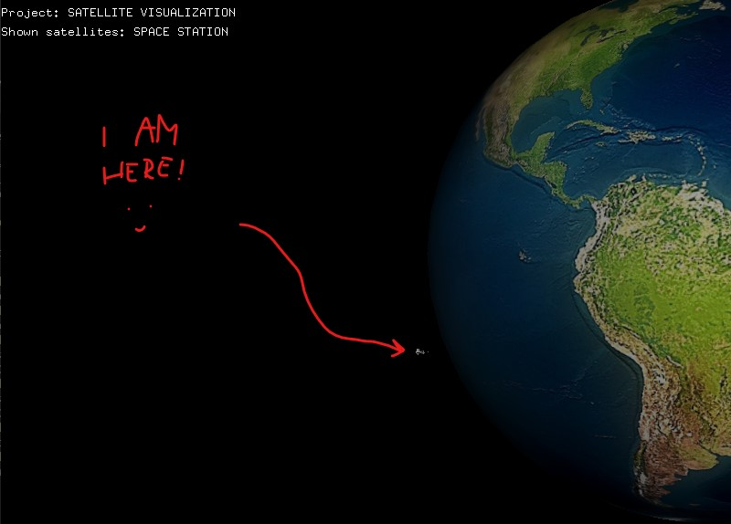

## The objective of the project is to visualize the movement of satellites around the earth using OpenGL :earth_africa::artificial_satellite:

---

### 1. Sphere construction

  
  

### 2. First satelite preview

  

